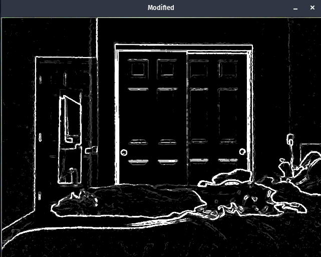
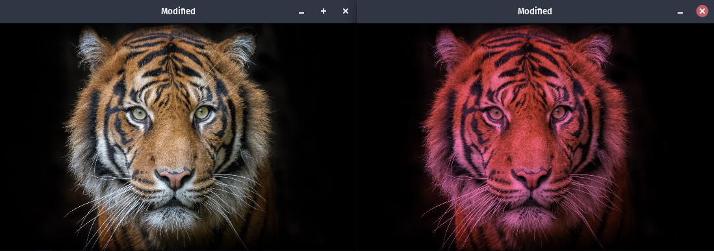
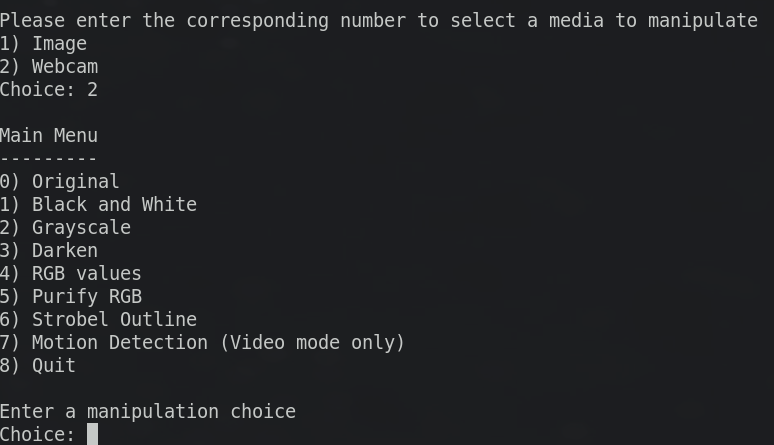

# Console Menu-Driven Image and Webcam Manipulation Program

The program uses opencv-4.0.0 to store image data in the Mat data type, and iterate through
images and manipulate pixels from an original image to a modified image via various algorithms
which detail computations with each individual (and surrounding) RGB values of pixels.

You can either manipulate an image or a webcam with each program execution, and if you want to toggle
your mode then you will need to quit the program and restart.

Also, please note: You must hit the <Esc> character to exit out of an image/video to return back
to the main menu! The "x" button does not work.

The program comes with a tiger.jpg image by default for image manipulation

Background
----------
I wrote this program during my sophomore year in CS. Due to not saving it correctly (was not 
familiar with git at the time), I rewrote it from a saved version found from its early development.

This program was the first time I experienced using a 3rd party library. It also was my first 
experience using CMake to compile the program without the help of an IDE, which was a great
learning experience. In addition, I also learned how to sanitize std::cin inputs reasonably, 
which allowed for a more stable user experience.

REQUIREMENTS
------------
The program uses opencv-4.0.0, a cross-platform library. The version 4.0.0 is not the latest version

> Obtaining version 4.0.0:

The library can be found on the opencv releases webpage.
It can also be found on the opencv github page: https://github.com/opencv/opencv/releases/tag/4.0.0

I highly recommend if you are going to build and install the library, that you follow a tutorial
provided by the opencv website.

> Important Note

If you're using Debian / Ubuntu, you can install the package libopencv-dev and you'll be set!   
``sudo apt-get install libopencv-dev``
  
If you're using Fedora / similar, you can install the package opencv-devel and you'll be set!   
``sudo dnf install opencv-devel``

Building and Running
--------------------

I included a CMakeLists.txt to allow for easy compilation of the program. If you are willing to use
CMake/Make to run the program, then please follow the steps down below to compile and run the program.

1) Create a directory called build inside the project's root directory (where .cpp file is)
2) cd into build
3) execute the command (without the quotation marks) "cmake .."
4) execute the command (without the quotation marks) "make"
5) Inside the bin directory of the project's root directory is the execuatable to run the program

How to add images
-----------------
Rule: The program can only manipulate .jpg images
1) Store the image you want to manipulate inside the bin/images directory
2) On a new line, type out the name of your added image inside the text file bin/imageNames.txt

The images are resized to 550 width x 350 height to fit on the screen, if this resolution works 
poorly with a given new image, then please feel free to modify the HEIGHT and WIDTH variables
to work with your image. The definitions for these variables can be found on lines 52,53 of 
ImageManipulation.cpp. Also, if the window appears in a poor position on your screen, feel free to 
adjust the moveWindow function call on line 99 of ImageManipulation.cpp

If the webcam fails
-------------------
First of all, if you don't have a webcam or a device connected to your machine capable of being a 
webcam, then this feature will not work for you. But if you do, and it's not working, then it's possible
the program's default choice of webcam selection is not picking the right choice for your machine. 
Simply change the argument of the function call cap.open() from 0 to 1,2... on line 124 on 
ImageManipulation.cpp

Ending Note
-----------
This program was a great learning experience for learning how to use a 3rd party library in my program,
how to set up CMake for compilation, and designing algorithms for desired features. I also learned
the importance of the structure and flow of program execution. If you have any questions or any bugs,
then please let me know. 
